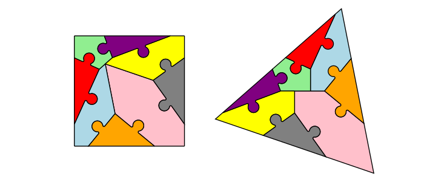
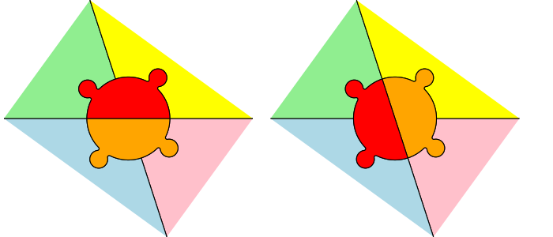
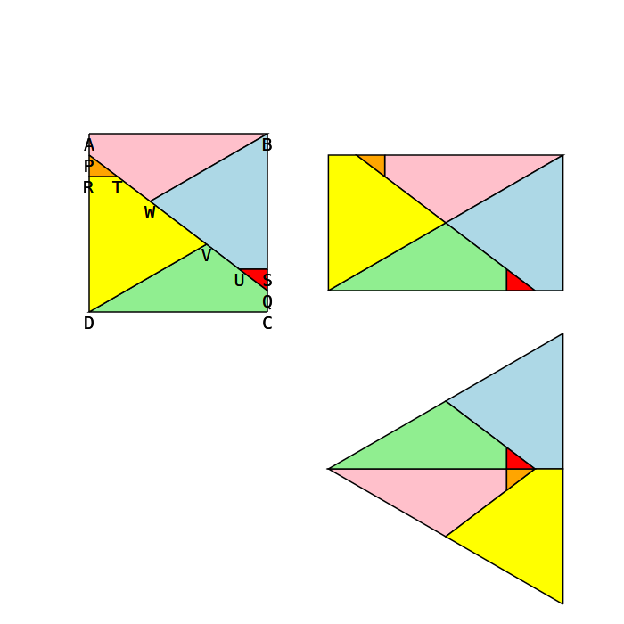
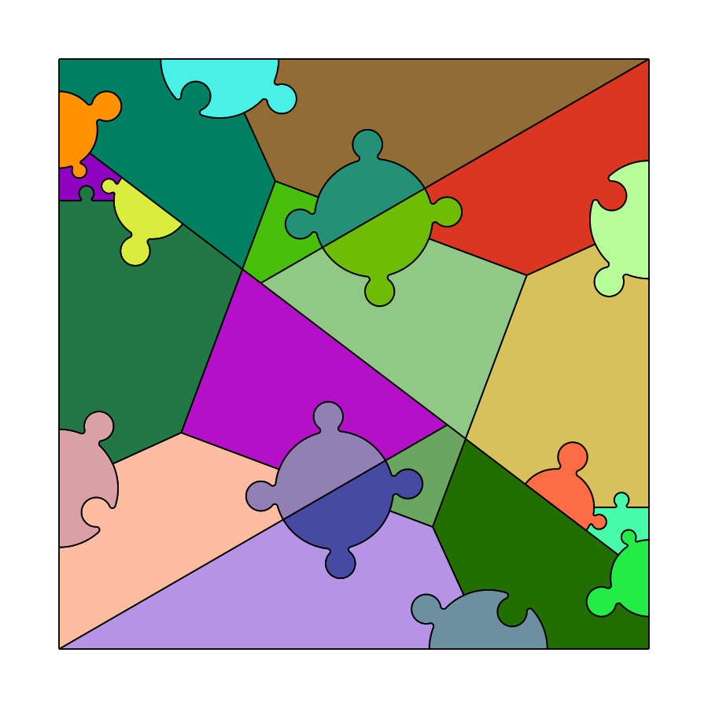

# Jigsaw dissections

## Motivation

> [!IMPORTANT]
> Read the dissections books of Greg N. Frederickson! All of them! They are amazing!

Motivated by the books of Frederickson I wanted to produce polygon dissections physically, especially hinged ones, as they looked particularly neat. However 3D printing a good hinge mechanism is not easy. Chapter 22 of "Hinged Dissections: Swinging & Twisting" describes how to turn hinges into twist hinges which rotate 180 degrees, which seemed easier to produce. Then I thought that a symmetric jigsaw connection corresponds to a twist hinge, thus replacing twist hinges with jigsaw connections produces dissections which look nice and remain stuck together.

## Goals and non-goals

Things I care about:
 * Easy 3D printing
    * In particular, the size of the smallest detail should be as large as possible.
    * Avoiding sharp angles, with which the circular (rather than linear) connector pieces help quite a bit, since they produce right angles where they meet the edges.
 * Symmetric look
 * Solid, non-flimsy results

Things I don't really care about:
 * Using few pieces for a dissection
 * Whether pieces are flipped during the dissection (when pieces are physically made from homogeneous 3D filament, they look roughly the same on both sides anyway)
 * Direction of grain (again, with 3D printing there is not really such a notion and I don't own a laser cutter)

## Turning any dissection into a jigsaw one

Since any two polygons of the same area can be dissected into each other, it is a question whether any pair can be jigsaw dissected. Using an edge connector to glue together edges which touch when either polygon is constructed from the pieces, one can produce a jigsaw dissection between any two polygon with the same area. This dissection will be rather boring, however, since all the connectors will be symmetric pieces and always in the middle of the edges.

## Turning hinged and twist hinged dissections into a jigsaw one

Snug hinges (defined in Chapter 2 of Frederickson's "Hinged Dissections: Swinging & Twisting" as hinges which rotate completely from one end state to the other) can be converted to twist hinges and thus jigsaw dissection like this:

Hinge connectors can be of any symmetrical shape, they don't need to be linear or circular, nor do the jigsaw connection need to be circular, as long as they are symmetrical. For simplicity though and nice looks, I prefer these shapes.

One advantage of jigsaw dissections is that often hinged dissections could go "all the way around", but for physical realization one hinge needs to be removed, which, then, after completely hinging the dissections around, meets up again. With jigsaw dissections, such hinged dissections could be fully "jigsawed", which makes the resulting product stable, rather than wanting to become unhinged and swing between the two end states, as it happens with hinged dissections.

Twist hinges, which are standalone 180 degree rotations along an axis perpendicular to the common edge of the two pieces, directly correspond to a jigsaw connection:

## Overlaying dissections

When one wishes to produce dissections among multiple polygons, one way to achieve that is to overlay multiple dissections. In such cases when external edges of two polygons intersect, one needs to insert a connector structure which holds the pieces together, with a flush outer edge, along either of the two intersecting polygon edges. This can be achieved like this:

## Examples

These dissections are based on the ideas from the Frederickson books. Buy them and read them, they are really, really great.

### Two equal squares to one

### Square to regular triangle

### Square to regular octagon

### Square to cross

### Square to 8/3 star

### Square, regular triangle and regular octagon

## Considerations for 3D printing

I've used OpenSCAD to print the pieces for these dissections, with a small offset of about -0.07 millimeters and a linear extrusion of 4 millimeters, resulting neat, snug jigsaw pieces which hold together well.

## The code

I've used complex numbers to produce the dissections, since they very naturally lend them to such a task and Python has built in support for them, allowing very compact writing of planar locations, rotations, scaling and translation.

I've written a very narrow SVG library to render these, and to render the names of points, to help during the production of the dissection.
